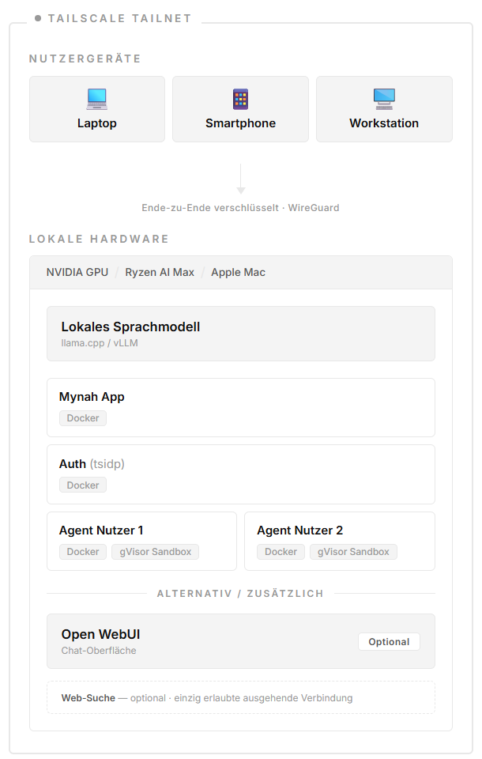

# Hermes Core Fork Spec (Current State)

This is the implementation-facing contract for the current `hermes-core` fork.

## Product Goal

Deliver a Tailnet-only, multi-user Hermes distribution that can be installed and operated with product-style workflows while keeping upstream Hermes internals largely intact.

Reference architecture:

## Primary Commands

- `hermes-core install`
  - prepares host prerequisites on supported Linux targets
  - installs product services/assets
  - runs setup unless explicitly skipped
- `hermes-core setup`
  - configures product network/auth/identity/workspace settings only
  - bootstraps bundled `tsidp` + OIDC client
  - starts app/runtime stack
- `hermes-core uninstall`
  - removes product-managed data/services
  - cleans up installer-managed state

Hermes-native configuration remains on the upstream CLI surface:

- `hermes setup model`
- `hermes setup tools`
- `hermes setup agent`

## Configuration Model

- Canonical product config: `~/.hermes/product.yaml`
- Generic Hermes config remains separate (`~/.hermes/config.yaml`).
- Product config controls:
  - Tailscale/tailnet settings
  - product web branding/title
  - `tsidp` integration
  - bootstrap/invite auth state
  - workspace quota
  - runtime container infrastructure
- Hermes config controls:
  - model/provider selection
  - enabled toolsets and tools
  - gateway configuration
  - general agent behavior
- Product uninstall preserves the generic Hermes config by design.
- A reinstall therefore reuses prior model/provider settings unless the operator explicitly removes `~/.hermes/config.yaml` and related non-product env entries.

## Runtime Model

- Per-user runtime containers.
- Per-user runtimes resolve model/provider/tool behavior from the main Hermes config.
- Default runtime toolsets in this fork are `file`, `terminal`, `memory` unless the operator broadens them with normal Hermes tool configuration.
- Runtime reuse is config-aware:
  - if staged runtime env differs from the running container env, the runtime container is recreated automatically
- Product runtime API surface remains narrow:
  - `GET /healthz`
  - `GET /runtime/session`
  - `POST /runtime/turn`
  - `POST /runtime/turn/stream`
- Product HTTP/install/setup/runtime entry files should remain thin orchestration layers over smaller fork-side helpers.
- Runtime workspace is user-scoped and live-mounted for user uploads.
- Runtime-local `SOUL.md` and generated runtime `config.yaml` are mounted read-only inside the container.
- The bundled runtime `SOUL.md` is product-specific and can be overridden by an operator-provided runtime SOUL template path in product setup.

## Auth and Access Contract

- `tsidp` is the bundled and only auth provider.
- Product app is an OIDC client.
- Tailnet URL is the only supported browser/login origin.
- First admin bootstrap uses a one-time bootstrap link created during `hermes-core setup`.
- First admin bootstrap can complete before any Hermes model is configured.
- Invited users claim accounts through one-time invite links on the Tailnet URL.
- No localhost or LAN login surface is part of the product contract.

## Admin User Management Contract

- Product users are fork-managed records keyed to Tailscale identity.
- First admin is created by the one-time bootstrap link and first successful `tsidp` login through it.
- Admin issues one-time invite links, not pre-created passwords or local accounts.
- The first Tailscale identity that opens a valid invite link and completes `tsidp` login claims that account.
- Pending invites are shown as placeholders until claimed or expired.

## Security/Isolation Contract

- Runtime access remains user-scoped.
- No LAN exposure for internal runtime control ports.
- Browser-side mutations require both same-origin validation and CSRF validation.
- `tsidp` tokens and invite/bootstrap token material must stay server-side where possible; admin placeholder IDs must not expose raw tokens.
- Product-side adaptation is preferred over upstream Hermes patching.
- Keep browser admin scope narrow (users/invites/deactivate), not full platform config.
- Current control plane is still host-installed and should be treated as an interim architecture.
- Product setup must not silently override Hermes-native model or tool configuration.

## Future Direction: Contained Control Plane

The current fork installs the Hermes control plane on the host and runs user chat execution in separate runtime containers. This keeps the product practical today, but it is not the desired long-term isolation model.

Target architecture:

- The host runs only a thin bootstrap/launcher layer.
- Hermes control-plane state moves into one dedicated product-managed container.
- That control-plane container owns:
  - Hermes config
  - provider credentials and runtime routing
  - tool policy
  - runtime defaults/templates
- Per-user runtimes remain separate containers derived from that server-managed configuration.
- `tsidp` and the product app continue as separate services with explicit network boundaries.

Why this is preferred over using the first admin runtime as the template/source of truth:

- avoids coupling platform bootstrap to one user account
- keeps model keys and provider settings in operator-owned infrastructure, not user-owned state
- avoids drift when the first admin changes personal runtime settings
- makes reset, migration, backup, and multi-user tenancy cleaner

Status:

- not implemented yet
- current system-level Hermes install is the temporary control-plane implementation
- future work should move toward a contained server control plane, not toward "first admin runtime = master runtime"

## Non-Goals (Current)

- Full browser-based product configuration console.
- Broad upstream Hermes rewrites for fork-specific product concerns.
- Feature parity with every upstream surface in the product web app.
